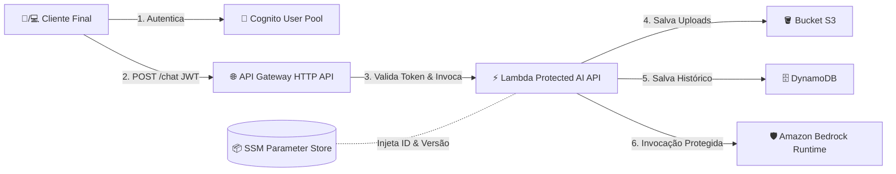

# aws-cdk-protected-serverless-ai-api

## Architecture


## Project Structure
```bash
aws-cdk-protected-serverless-ai-api/
├── .venv/                          # Python virtual environment (after active Virtual Env)
├── .gitignore                     
├── README.md                      
├── app.py                          # AWS CDK CLI application entry point
├── cdk.json                        # CDK syntax and context settings
├── requirements.txt                # Python dependencies (aws-cdk-lib, constructs, etc.)
└── stacks/
    ├── __init__.py                
    ├── api_stack.py                # Main CloudFormation Stack Orchestrator
    ├── constructs/
    │   ├── __init__.py            
    │   ├── network_construct.py    # Public/Private Subnets and Dedicated VPS
    │   ├── auth_construct.py       # Cognito User Pool e Authorizer JWT
    │   ├── storage_construct.py    # Bucket S3 e Tabela DynamoDB
    │   └── api_construct.py        # API Gateway HTTP, Lambda Handler e Importação do SSM
    └── src/
        ├── __init__.py            
        └── handler.py              # Código Python da Lambda (Consumidor Bedrock Nova Lite)

```

## Quick Start
```bash
# 0. After clone:
cd aws-cdk-protected-serverless-ai-api
```

### Virtual Env (.venv)

**- in macOS / Linux terminal:**
```bash
# 1. Create the virtual environment in the project directory, and activate the virtual environment
python3 -m venv .venv
source .venv/bin/activate
```

**- in Windows PowerShell:**
```powershell
# 1. Create the virtual environment in the project directory, and activate the virtual environment
python -m venv .venv
.\.venv\Scripts\Activate.ps1
```

**Validation:** Upon successfully activating the environment, you will see the `(.venv)` prefix before the prompt in your terminal.

**- Then, in (.venv) in any terminal:**
```bash
# 2. Install project dependencies (AWS CDK, constructs, etc.)
python -m pip install --upgrade pip
pip install -r requirements.txt
```

**Deactivate the virtual environment:** When you finish development, simply type and run `deactivate` in any terminal.


### AWS CDK

```bash
# 3. Prepare the Account/Region (required only the first time)
cdk bootstrap aws://YOUR_AWS_ACCOUNT/YOUR_REGION

# 4. Synthesizes the infrastructure (checking the conversion from Python to CloudFormation)
cdk synth

# 5. Deploys the infrastructure
cdk deploy

# 6. Destroy resources (when necessary)
cdk destroy
```

**Prerequisites:** Needs `aws configure` already set up. If not, please, check the official AWS Docs: [Configuration and credential file settings in the AWS CLI](https://docs.aws.amazon.com/cli/v1/userguide/cli-configure-files.html)

## Author

**Thiago Ericson Cabral**
- [LinkedIn](https://www.linkedin.com/in/thiagoericson/)
- [Medium](https://medium.com/@thiagoericson)
- [AWS Builder Center](https://builder.aws.com/community/@thiagocabral)
- [Github](https://github.com/thiagoericson/)
- [DEV Community](https://dev.to/thiagocabral)

Let's connect!